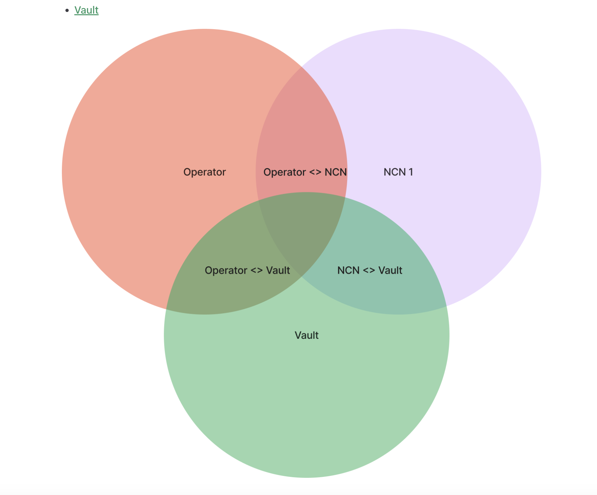

## Jito Restaking Architecture Overview

The Jito (Re)Staking protocol facilitates the relationship between three components:

- [NCN](./ncn)
- [Operator](./operator)
- [Vault](./vault)

All three components must opt-in to a three-way relationship in order to warm-up and activate a staked relationship.

If any of the three components is not "opt-in", there is no stake i.e. the relationship between each component is inactive. 
Additionally, any component can opt-out of active staked relationships, in which case the protocol will cool down the relationship in the next epoch and deactivate stake. 
Conversely, relationships can be warmed up.

and then for the photo, i think it would be good to add "Active Stake" in the middle. (also take out the "1" next to "NCN" in the purple circle just to keep the naming consistent"and i think just to make things super clear, it is worth adding another venn diagram where one of the relationships is not opted-in... maybe you can do "NCN </> Vault" and then in the middle of the diagram, add "Inactive"