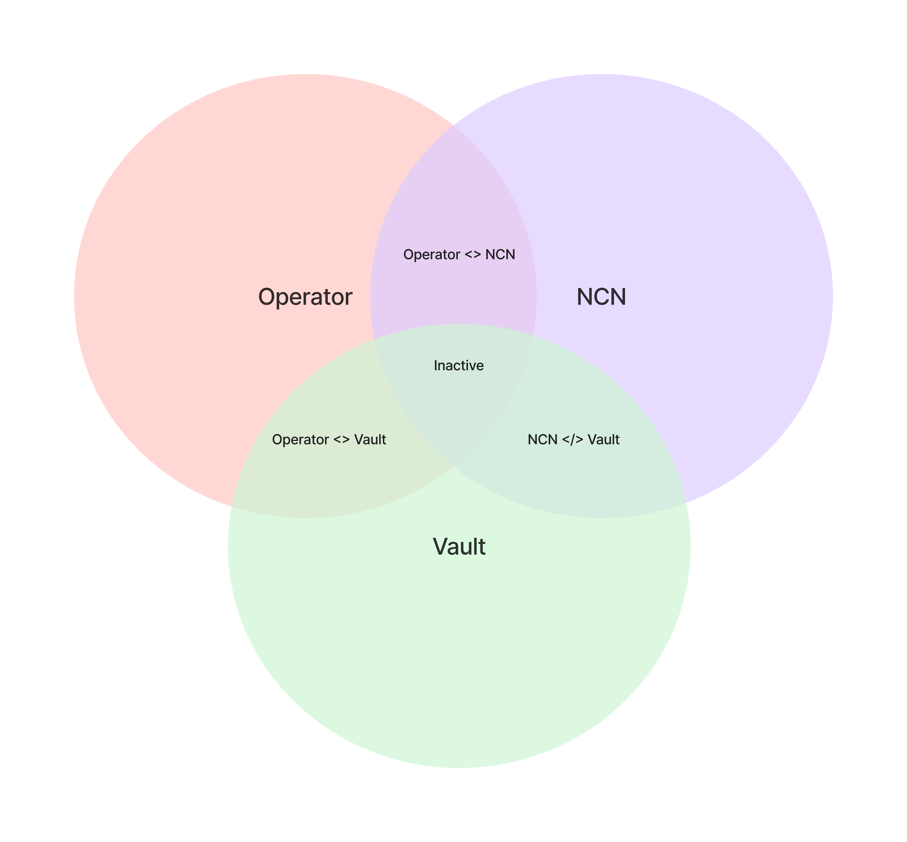

## Jito Restaking Architecture Overview

The Jito (Re)Staking protocol facilitates the relationship between three components:

- <a href="./ncn" target="_blank">NCN</a>
- <a href="./operator" target="_blank">Operator</a>
- <a href="./vault" target="_blank">Vault</a>

<figure>
    
    <figcaption>
        Figure 1: Active Relationship State - Visual representation of the three-way relationship between NCN, Operator, and Vault components when all have opted in, resulting in activated stake.
    </figcaption>
</figure>

All three components must opt-in to a three-way relationship in order to warm-up and activate a staked relationship.

If any of the three components is not "opt-in", there is no stake i.e. the relationship between each component is inactive. 
Additionally, any component can opt-out of active staked relationships, in which case the protocol will cool down the relationship in the next epoch and deactivate stake. 
Conversely, relationships can be warmed up.

<figure>
    
    <figcaption>
        Figure 2: Inactive Relationship State - Visual representation of what happens when one or more components haven't opted in or have opted out, resulting in a deactivated stake.
    </figcaption>
</figure>
