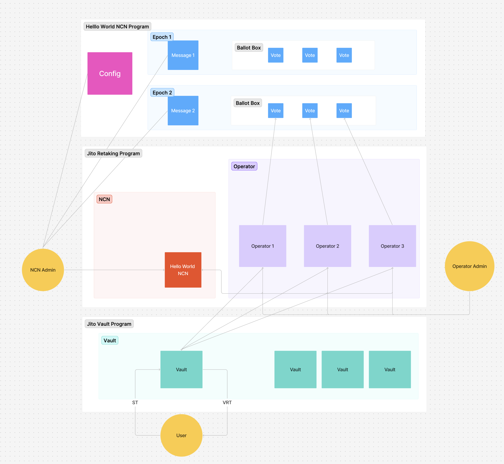

This tutorial will guide you through building a Hello World NCN (Node Consensus Network) on Jito Restaking. 
This introductory example will help you understand the fundamental concepts of NCN development and how it interacts with the Jito Restaking ecosystem.

## Hello World NCN

The Hello World NCN is a simple implementation that demonstrates the core mechanics of how NCNs operate within the Jito Restaking framework. 
This example serves as an educational foundation that illustrates both the infrastructure setup and operational flow of a basic NCN.

### By Jito Restaking:

1. Register all components

    - Registering NCN in the Jito Restaking Protocol
    - Registering Operators who will perform work
    - Registering Vault that delegate assets to operators, establishing the economic security model

2. Opt-in all components

    - Activating the registered components to participate in the network
    - Establishing the connection between different entities in the ecosystem

3. Delegate the asset from Vault to Operator

    - Creating the economic relationship between `Vaults` and `Operators`
    - Establishing the stake that secures the network and incentivizes honest behavior

### NCN Program:

The NCN program demonstrates the core workflow of a consensus network:

    - **Admin creating messages that need to be processe by Operators**

        - In our Hello World NCN example, these are simple text messages
        - These messages define the work that requires consensus and initiate the process

        <Callout>
            In real NCNs, admin messages represent input data like:
            
            - Reports from DePIN (Decentralized Physical Infrastructure Network) devices
            - Asset price information for oracle services
            - Solana Epoch snapshots for Jito Tip Router operations
        </Callout>

    - **Operators performing computation and responding to messages**

        - In our example, operators calculate a SHA-256 hash of the message

        <Callout>
            In real NCNs, operator might:
            
            - Verify data from multiple sources
            - Calculate aggregate values (median prices, averages, etc.)
            - Generate proofs or attestations about off-chain data
        </Callout>

    - **Operators responding to messages and submitting signed responses**

        - Our example stores the computed hash directly on-chain

        <Callout>
            In production NCNs, responses are typically:
            
            - Compressed or represented as merkle roots due to Solana data limits
            - Full response data is stored off-chain by operators
            - Only verification data or hashes are stored on-chain
        </Callout>
    
    - **Program verifying consensus among operator responses**

        - Our example checkes if a minimum number operators provided matching results
        - This ensures honest behavior is enforced by economic stake
        - The verification process is transparent and can be audited by all participants

The Hello World implementation demonstrates these concepts with simple message processing, but the same principles apply to complex real-world applications like oracle networks, DePIN services, and cross-chain bridges.

## Let's Build

Follow these steps to create your own Hello World NCN:

- Clone the [repo](https://github.com/aoikurokawa/hello-world-ncn)
- Set up your development environment using the prerequisites below
- Explore the codebase to understand the implementation details
- Deploy and test Hello World NCN using the provided scripts and documentation

### Prerequisites

Before getting started, ensure you have the following tools installed:

- [Rust] - The programming language used for NCN development
- [Solana CLI] - Command-line tools for interacting with the Solana blockchain
- [Jito Restaking CLI] - Tools specific toe the Jito Restaking Protocol

[Rust]: https://www.rust-lang.org/tools/install
[Solana CLI]: https://solana.com/docs/intro/installation
[Jito Restaking CLI]: https://github.com/jito-foundation/restaking/blob/master/cli/getting_started.md