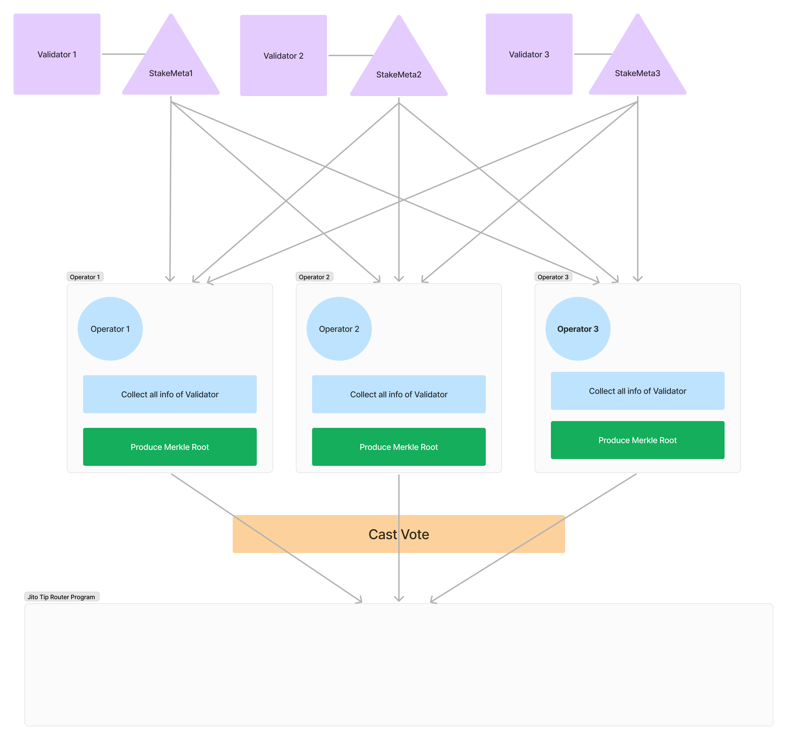
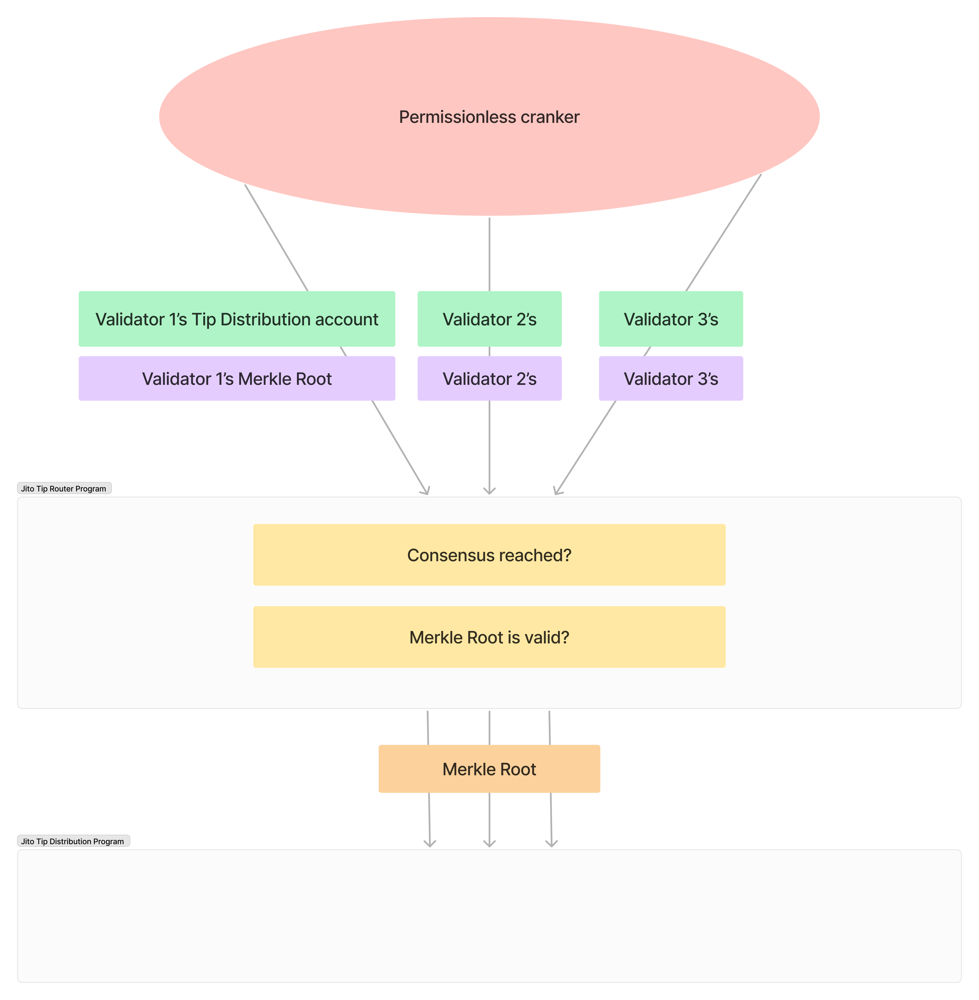
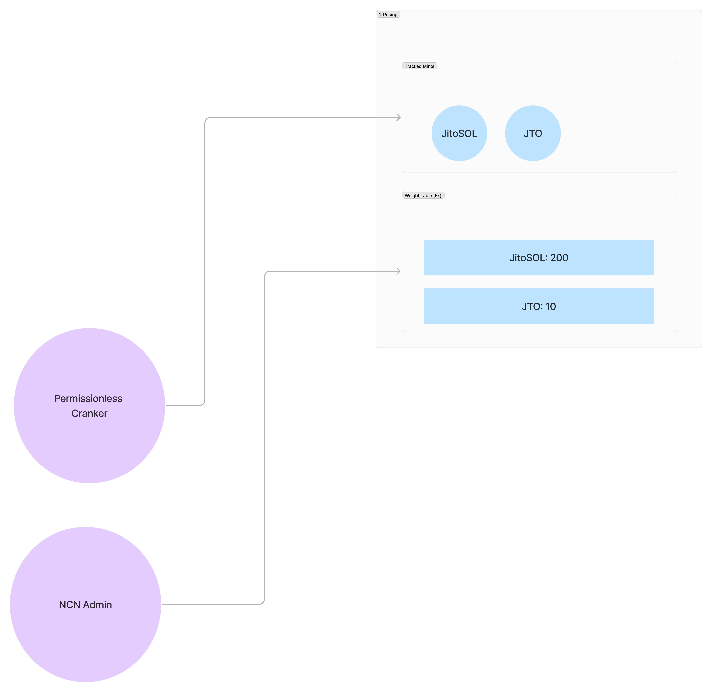
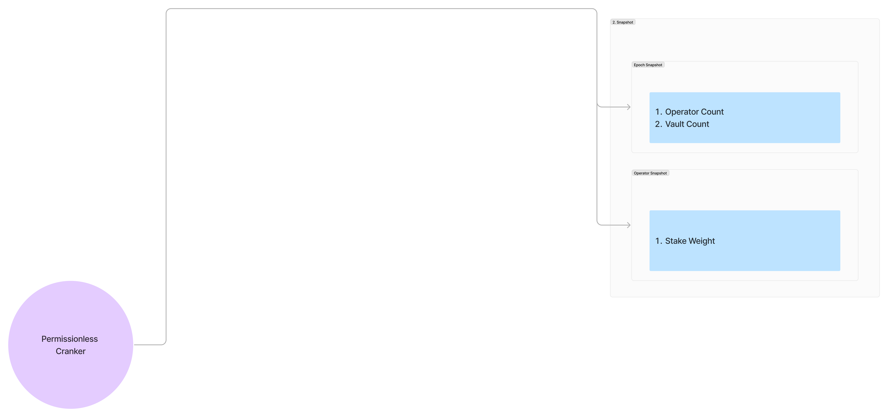

## Overview

### Previous Process

- Each validator has a unique tip distribution account, owned by the [Jito Tip Distribution Program], where SOL is collected for a given epoch.
- At the end of the epoch, an off-chain process takes place which produces a merkle tree and merkle root for each validator’s tip distribution account. 
    - Validators can run this process themselves or delegate it to another party.
    - The merkle tree is intended to distribute any SOL in the account to the validator based on their MEV commission rate. Remaining funds are sent to stakers’ stake accounts pro-rata.
- After the merkle root has been uploaded, merkle proofs are uploaded on-chain and the program will transfer SOL from the tip distribution account to the validator’s vote account and stake accounts. 

### Problem

- Merkle root upload authority is permissioned with opt-in from each Jito-Solana validator. This mechanism creates a single point of potential failure with adverse impacts on network stakeholders and lacks transparency on the calculation.

### Solution

The TipRouter NCN leverages Jito (Re)staking to empower a set of node operators to achieve consensus on the correct merkle root for MEV tip distribution.

The mechanism of the TipRouter NCN is detailed below:

- Validators can delegate the merkle root upload authority to a program derived address owned by the NCN, giving it permission [to upload merkle roots].
- After the epoch rollover, node operators will compute a 'meta merkle root' — a merkle root derived from a new merkle tree containing all validator merkle trees — and upload it on-chain. This change reduces the number of votes required, as operators now vote on the meta merkle root instead of casting individual votes for each validator.

<Callout>

Inside of Stake Meta:

- validator_vote_account: The account representing the validator's voting authority.
- validator_node_pubkey: The public key of the validator node.
- maybe_tip_distribution_meta: Metadata related to tip distribution, if applicable.
    - merkle_root_upload_authority: The authority responsible for uploading the merkle root.
    - tip_distribution_pubkey: The public key owned by the Jito Tip Distribution Program.
    - total_tips: The total amount of tips in the [`TipDistributionAccount`]
    - validator_fee_bps: The validator's cut of tips from [`TipDistributionAccount`], calculated from the on-chain commission fee bps.
- delegations: Delegations to this validator.
    - stake_account_pubkey: The public key of the stake account.
    - staker_pubkey: The public key of the staker.
    - withdrawer_pubkey: The public key authorized to withdraw from the stake account.
    - lamports_delegated: Lamports delegated by the stake account
- total_delegated: The total amount of delegations to the validator.
- commission: The validator's delegation commission rate as a percentage between 0-100.

</Callout>

- After each vote, consensus of node operators will be checked. After ⅔ of stake agrees on a merkle root for a given validator, a cross program invocation will take place to upload the merkle root to the validator’s tip distribution account.
- Operators can change their vote until consensus is reached, then they can not change their vote. Once consensus is reached, any operators who have not voted have a fixed window of slots to submit their vote in order to be eligible for rewards.

[Jito Tip Distribution Program]: https://github.com/jito-foundation/jito-programs/blob/master/mev-programs/programs/tip-distribution/src/lib.rs
[to upload merkle roots]: https://github.com/jito-foundation/jito-tip-router/blob/022fee74773170b76d1f8aad8c8edc71fd387e05/program/src/set_merkle_root.rs#L61-L80
[`TipDistributionAccount`]: https://github.com/jito-foundation/jito-programs/blob/6bf84c19db9208a16e226074c666c965f5429d88/mev-programs/programs/tip-distribution/src/state.rs#L29-L54

## NCN Program

Following the [NCN design section], Jito Tip Router consists of:

- Pricing
- Snapshot
- Core Logic
- Reward Payment

[NCN design section]: /building-ncn/ncn-design.html#onchain-ncn-program

### Pricing

**Permissionless Cranker**:

Prepare several accounts like `TrackedMints` and `WeightTable`.

- [Initialize TrackedMints account](https://github.com/jito-foundation/jito-tip-router/blob/master/program/src/initialize_tracked_mints.rs)
- [Register Mint](https://github.com/jito-foundation/jito-tip-router/blob/master/program/src/register_mint.rs)
- [Initialize WeightTable account](https://github.com/jito-foundation/jito-tip-router/blob/master/program/src/initialize_weight_table.rs)

**NCN Admin**:

NCN admin update *weight* of supported token on Tip Router NCN.

- [Update WeightTable account](https://github.com/jito-foundation/jito-tip-router/blob/master/program/src/admin_update_weight_table.rs)

### Snapshots (Operator + Vault)

Take snapshots of Operator and Vault per epoch.

**Permissionless Cranker**:

Aggregate all information of operators and vaults associated with NCN

- [Initialize EpochSnapshot account](https://github.com/jito-foundation/jito-tip-router/blob/master/program/src/initialize_epoch_snapshot.rs)
- [Initiazize OperatorSnapshot account](https://github.com/jito-foundation/jito-tip-router/blob/master/program/src/initialize_operator_snapshot.rs)

### Core Logic (Consensus)

**Permissionless Cranker**:

Prepare Ballot Box, all votes would be collected here.

- [Initialize Ballot Box](https://github.com/jito-foundation/jito-tip-router/blob/master/program/src/initialize_ballot_box.rs)

After consensus reached with more than 2/3, cranker can upload the merkle tree of each validator.

- [Set Merkle Root](https://github.com/jito-foundation/jito-tip-router/blob/master/program/src/set_merkle_root.rs)

**Operator**:

Each operator calculate the merkle tree to produce merkle root then cast vote with produced merkle root.

- [Cast Vote](https://github.com/jito-foundation/jito-tip-router/blob/master/program/src/cast_vote.rs)

### Reward Payment

The Reward Payment module in the Jito Tip Router is responsible for distributing rewards generated from tips.
It ensures efficient routing and allocation of rewards to all relevant parties, including base reward recipients, operators, and vaults. 

## References
- [JIP-8: Adopt TipRouter NCN (Protocol Development)](https://forum.jito.network/t/jip-8-adopt-tiprouter-ncn-protocol-development/413)
- [Jito Tip Router Repo](https://github.com/jito-foundation/jito-tip-router/tree/master)
