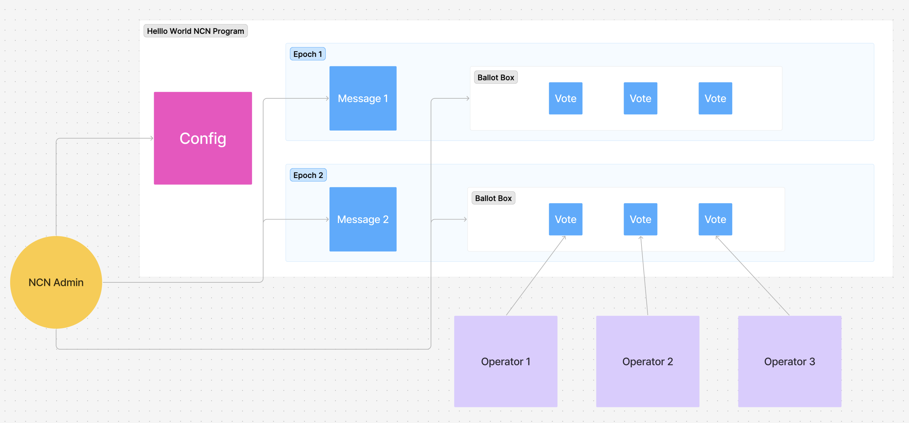

# Hello World NCN On-Chain Program

This section explores the implementation of the on-chain program for our Hello World Node Consensus Network (NCN). 
The program demonstrates the core functionality required for a basic consensus mechanism built on Jito Restaking.



## Program Architecture

The Hello World NCN program consists of four main instruction handlers that implement the complete lifecycle of a consensus operation:

1. **Initialize Config** - Sets up the program Configuration
2. **Initialize BallotBox** - Creates a new ballot box for collecting consensus votes
3. **Request Message** - Creates a new message that requires operator consensus
4. **Submit Message** - Allows operators to submit their votes on a message


## Core Components

### Configuration (Config)

The Config account stores the basic parameters for the NCN:

```rust
pub struct Config {
    // NCN Pubkey
    pub ncn: Pubkey,

    // Minimum Stake
    pub min_stake: PodU64,
}
```

- `ncn`: The public key of the NCN registered in Jito Restaking
- `min_stake`: The minimum amount of stake required for an operator to participate

The Config is initialized once when the program is first set up and serves as a reference point for all other operations.

### Message

The Message account represents a piece of data that requires consensus from operators:

```rust
pub struct Message {
    /// NCN
    ncn: Pubkey,

    /// Epoch
    epoch: PodU64,

    /// The length of keyword
    keyword_len: u8,

    /// Message Data
    keyword: [u8; 64],
}
```

- `ncn`: The public key of the associated NCN
- `epoch`: The epoch in which this message was created
- `keyword_len`: The length of keyword
- `keyword`: A string value that operators must confirm

Messages are created by the NCN admin and then processed by operators who submit their responses.

### BallotBox

The BallotBox collects votes from operators and determines when consensus is reached:

```rust
pub struct OperatorVote {
    /// The operator that cast the vote
    operator: Pubkey,

    /// The slot the operator voted
    slot_voted: PodU64,

    /// The index of the ballot in the ballot_tallies
    vote_index: PodU16,

    /// The length of message
    message_len: u8,

    /// The message operator submitted
    message_data: [u8; 64],
}

pub struct BallotBox {
    /// The NCN account this ballot box is for
    ncn: Pubkey,

    /// The epoch this ballot box is for
    epoch: PodU64,

    /// Slot when this ballot box was created
    slot_created: PodU64,

    /// Slot when consensus reached
    slot_consensus_reached: PodU64,

    /// Number of operators that have voted
    operators_voted: PodU64,

    /// Operator votes
    pub operator_votes: [OperatorVote; 3],
}
```

- `ncn`: The public key of the associated NCN
- `epoch`: The epoch for this voting round
- `created_at`: The slot when the ballot box was created
- `votes`: A collection of votes from different operators

## Program Flow

### 1. Program initialization

Before the NCN can operate, we must initialize the configuration:

```rust
pub fn process_initialize_config(
    program_id: &Pubkey,
    accounts: &[AccountInfo],
    min_stake: u64,
) -> ProgramResult {
    // ... validation code ...
    
    // Create Config account
    create_account(
        ncn_admin_info,
        config_info,
        system_program_info,
        program_id,
        &Rent::get()?,
        8_u64
            .checked_add(std::mem::size_of::<Config>() as u64)
            .ok_or(HelloWorldNcnError::ArithmeticOverflow)?,
        &config_seeds,
    )?;
    
    // Initialize Config data
    let mut config_data = config_info.try_borrow_mut_data()?;
    config_data[0] = Config::DISCRIMINATOR;
    let config_acc = Config::try_from_slice_unchecked_mut(&mut config_data)?;
    *config_acc = Config::new(*ncn_info.key, min_stake);
    
    Ok(())
}
```

This function:

1. Validates that the caller is authorized
2. Creates a new Config account at a deterministic PDA (Program Derived Address)
3. Initializes the account with the NCN key and minimum stake requirement

### 2. Starting a Consensus Round

Each consensus round begins with creating a BallotBox for the current epoch:

```rust
pub fn process_initialize_ballot_box(
    program_id: &Pubkey,
    accounts: &[AccountInfo],
) -> ProgramResult {
    // ... validation code ...
    
    // Create BallotBox account
    create_account(
        ncn_admin_info,
        ballot_box_info,
        system_program_info,
        program_id,
        &Rent::get()?,
        8_u64
            .checked_add(std::mem::size_of::<BallotBox>() as u64)
            .ok_or(HelloWorldNcnError::ArithmeticOverflow)?,
        &ballot_box_seeds,
    )?;
    
    // Initialize BallotBox data
    let mut ballot_box_data = ballot_box_info.try_borrow_mut_data()?;
    ballot_box_data[0] = BallotBox::DISCRIMINATOR;
    let ballot_box_acc = BallotBox::try_from_slice_unchecked_mut(&mut ballot_box_data)?;
    *ballot_box_acc = BallotBox::new(*ncn_info.key, epoch, slot);
    
    Ok(())
}
```

This creates an empty BallotBox tied to the current epoch, ready to collect votes from operators.

### 3. Creating a Message for Consensus

The NCN admin requests a new message that requires operator consensus:

```rust
pub fn process_request_message(program_id: &Pubkey, accounts: &[AccountInfo]) -> ProgramResult {
    // ... validation code ...
    
    // Create Message account
    create_account(
        ncn_admin_info,
        message_info,
        system_program_info,
        program_id,
        &Rent::get()?,
        8_u64
            .checked_add(std::mem::size_of::<Message>() as u64)
            .ok_or(HelloWorldNcnError::ArithmeticOverflow)?,
        &message_seeds,
    )?;
    
    // Initialize Message data
    let mut message_data = message_info.try_borrow_mut_data()?;
    message_data[0] = Message::DISCRIMINATOR;
    let message_acc = Message::try_from_slice_unchecked_mut(&mut message_data)?;
    *message_acc = Message::new(*ncn_info.key, epoch, "Hello");
    
    Ok(())
}
```

This creates a new Message with the keyword "Hello" that operators must validate.


### 4. Submitting Votes

Operators submit their votes by calling the `submit_message` instruction:

```rust
pub fn process_submit_message(
    program_id: &Pubkey,
    accounts: &[AccountInfo],
    message: String,
) -> ProgramResult {
    // ... extensive validation code ...
    
    // Cast vote
    ballot_box.cast_vote(operator_info.key, &message, current_slot)?;
    
    // Check if consensus is reached
    if ballot_box.is_consensus_reached() {
        msg!("Consensus reached for epoch {} with ballot", current_epoch);
    }
    
    Ok(())
}
```

The submit_message function:

1. Performs extensive validation including:

    - Verifying the operator is registered and active
    - Confirming the operator has sufficient stake delegated
    - Validating the connections between NCN, Vault, and Operator


2. Records the operator's vote in the BallotBox
3. Checks if consensus has been reached

### Security and Validation

The `Hello World NCN` program implements several security measures:

#### Stake-Based Participation

Operators must have minimum amount of stake delegated to them:

```rust
if total_security < ncn_config.min_stake() {
    msg!(
        "VaultOperatorDelegation is not correct, expected: {}, actual: {}",
        ncn_config.min_stake(),
        total_security
    );
    return Err(ProgramError::InvalidAccountData);
}
```

This ensures that operators have economic stake in the system. aligning their incentives with honest behavior.

#### Connection Validation

The program verifies that all components (NCN, Operators, Vaults) are properly connected and active:

```rust
if !vault_ncn_ticket
    .state
    .is_active(current_slot, restaking_config.epoch_length())
{
    msg!("VaultNcnTicket is not active");
    return Err(ProgramError::InvalidAccountData);
}

if !ncn_vault_ticket
    .state
    .is_active(current_slot, restaking_config.epoch_length())
{
    msg!("NcnVaultTicket is not active");
    return Err(ProgramError::InvalidAccountData);
}
```

This ensures that only properly registered and active participants can contribute to consensus.

#### Message Validation

Operators must submit messages that match the required format:

```rust
if !message.starts_with(&message_acc.keyword()) {
    return Err(ProgramError::InvalidAccountData);
}
```

This simple validation ensures that operators are responding to the correct challenge.

## Extending the Example

1. Custom Validation Logic: Implement more complex validation rules for messages
2. Threshold Consensus: Modify the consensus mechanism to require a specific percentage of operators


## Conclusion

The Hello World NCN demonstrates a simple but complete consensus mechanism built on Jito Restaking. It shows how to:

1. Register and connect all components in the Jito Restaking ecosystem
2. Initialize program state and configuration
3. Create and process messages that require consensus
4. Collect and validate votes from operators
5. Determine when consensus is reached

By building on this foundation, you can create more complex NCNs that perform useful consensus work in a secure and economically incentivized manner.


